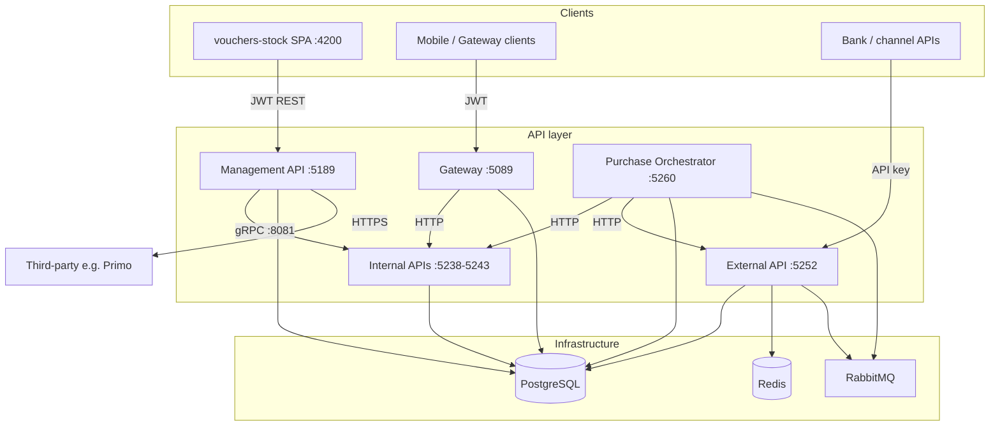

# Platform capabilities

This section documents the architecture, capabilities, and design decisions behind the MITF Voucher Provider platform.

---

## Service map

---

## 1. Data integrity

| Capability | Detail |
|------------|--------|
| **Idempotent operations** | Reservation idempotency records prevent duplicate replay |
| **Atomic saga state** | MassTransit saga persistence for bundle/international purchases |
| **Audit trail** | `UserActivities` table records admin actions |
| **Export integrity** | Voucher secrets encrypted at export with per-target keys |

---

## 2. Messaging consistency

| Capability | Detail |
|------------|--------|
| **Transactional outbox** | MassTransit EF Core outbox via PostgreSQL |
| **Consumer concurrency** | Configurable prefetch on reservation queues |
| **Async command path** | RabbitMQ for reservation processing |
| **Explicit consistency contract** | Sync HTTP for reserve/confirm; async for deferred reservation |

---

## 3. Load protection

| Capability | Detail |
|------------|--------|
| **Reservation backpressure** | Queue depth management with configurable retry |
| **Saga concurrency gate** | Orchestrator controls in-flight bundle/international purchases |
| **Rate limits** | Per-endpoint rate limiting on Customer Gateway |

---

## 4. Security & tenant isolation

| Capability | Detail |
|------------|--------|
| **API key authentication** | Every request must include valid key or rejected with 401 |
| **JWT Bearer** | Management and Gateway use JWT with configurable expiry |
| **Permission policies** | Granular RBAC via `Permissions.*` policies |
| **CORS** | Exact origin (scheme + host + port) required for Management API |

---

## 5. Observability

| Capability | Detail |
|------------|--------|
| **OpenTelemetry** | OTLP → Prometheus / Loki / Tempo → Grafana |
| **Structured logging** | Serilog JSON sinks to Loki / SQL |
| **Health endpoints** | `/health` (liveness), `/health/ready` (readiness) |
| **Metrics** | `/metrics` exposes Prometheus endpoint |

---

## 6. Bounded contexts

| Service | Persistence | Sync | Async |
|---------|-------------|------|-------|
| Management | PostgreSQL | REST, gRPC | None |
| External | PostgreSQL | REST, gRPC | MassTransit / RabbitMQ |
| Internal | PostgreSQL | REST, gRPC | None |
| Gateway | PostgreSQL | REST | None |
| Orchestrator | PostgreSQL | REST | MassTransit / RabbitMQ |

---

## Related documentation

- [Workspace overview](workspace-overview.md)
- [System specifications](system-specs.md)
- [Flow diagrams](flow-diagrams.md)
- [Production deployment](../operations/production-deployment.md)
