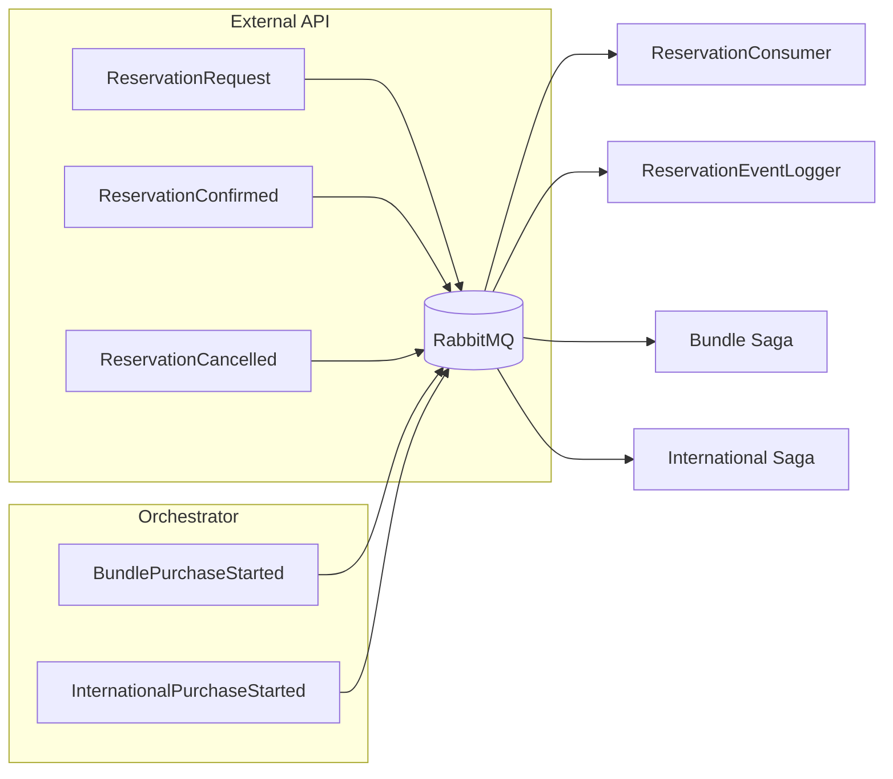

# Domain events

## Event catalog

| Event | Source | Consumer(s) | Mechanism |
|-------|--------|-------------|-----------|
| `ReservationRequest` | External API | ReservationConsumer (External) | MassTransit / RabbitMQ |
| `ReservationConfirmed` | External API | ReservationEventLogger | MassTransit / RabbitMQ |
| `ReservationCancelled` | External API | ReservationEventLogger | MassTransit / RabbitMQ |
| `BundlePurchaseStarted` | Orchestrator | Saga state machine | MassTransit |
| `InternationalPurchaseStarted` | Orchestrator | Saga state machine | MassTransit |
| `PurchaseCompleted` | Orchestrator | Archives | MassTransit |

---

## Event flow

---

## Related pages

- [Flow diagrams](flow-diagrams.md)
- [Platform capabilities](README.md)
