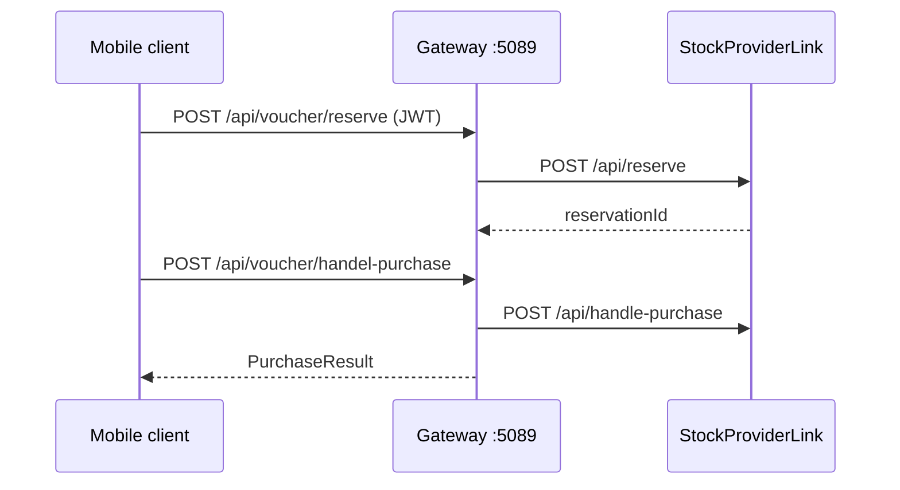
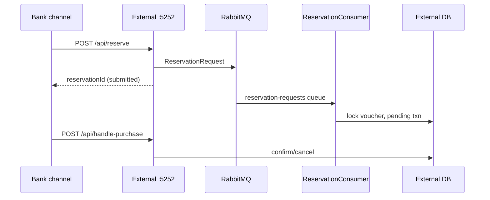
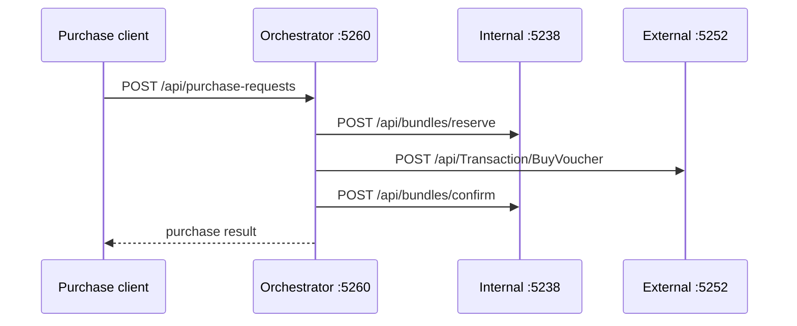
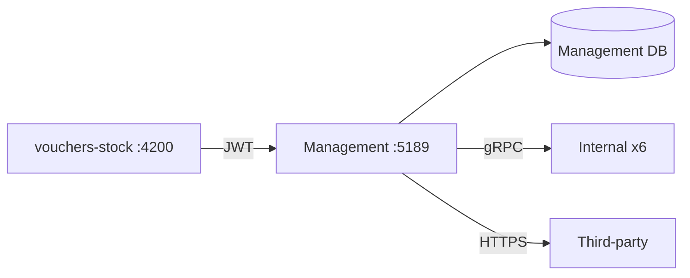
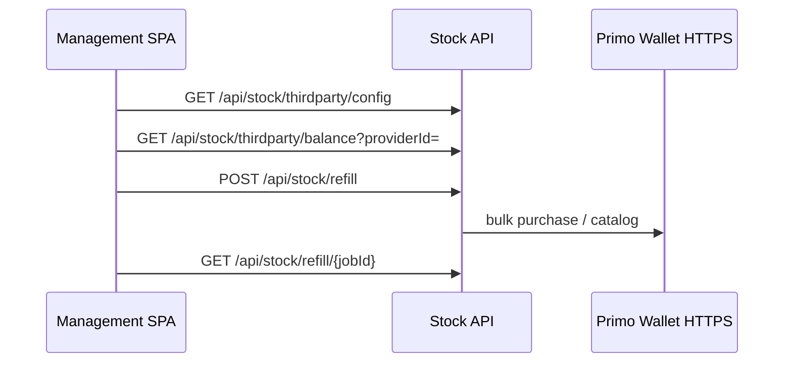
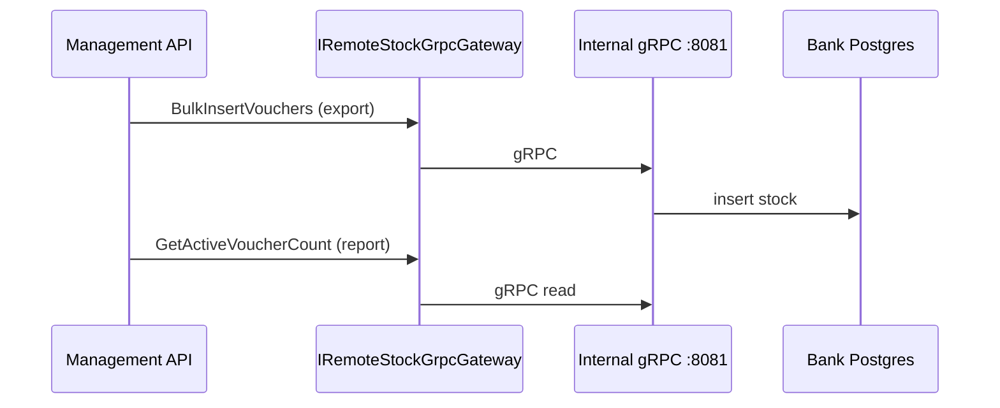

# Flow diagrams

End-to-end flows for QA and integrators. Pair with [service reference index](../reference/) for endpoint tables.

---

## 1. Purchase / reservation flow

Three related paths: Gateway BFF, External async reservations, and Orchestrator sagas.

### 1A. Gateway BFF (synchronous)

### 1B. External API (async via RabbitMQ)

### 1C. Purchase orchestrator (bundle saga)

Requires compose profile `orchestrator`.

**Saga states:** Initial → AwaitingReservation → AwaitingBankTransaction → AwaitingConfirmation → AwaitingArchiving → Finalized

---

## 2. Stock management flow

**Startup:** Migrations/seed run in background. `GET /health/ready` returns **503** until seed completes.

**Key operations:**

| Operation | Mechanism |
|-----------|-----------|
| Import vouchers | Local MainStock DB only |
| Export to bank | Lock local stock → gRPC BulkInsertVouchers |
| Branch transfer | gRPC AcquireTransferVouchers / ReleaseTransferVouchers |
| Reports on bank stock | gRPC read RPCs |
| Third-party refill | HTTPS to Primo + local job queue |

SPA routes vs API paths: [Reports API guide](../reference/reports-api-guide.md)

---

## 3. Third-party stock integration

`providerId` = **ThirdPartyProviderConfigs.Id** — see [API conventions](../reference/api-conventions.md).

Timestamp rules: [Primo Wallet timestamps](../reference/primo-wallet-timestamps.md)

---

## 4. Remote foreign stock gRPC flow

**Proto:** `grpc/stock_remote_v1.proto`

---

## 5. RabbitMQ / MassTransit message flows

| Service | MassTransit |
|---------|-------------|
| External | Reservation consumers |
| Orchestrator | Bundle + international sagas |
| Management, Internal, Gateway | None |

**Broker:** RabbitMQ vhost `voucher`, UI http://localhost:15672

**External queues:** `reservation-requests`, `reservation-event-logger`

---

## QA journey flows

| Tag | Command | Flow |
|-----|---------|------|
| `@smoke` | `npm run e2e -- --grep @smoke` | Critical path smoke |
| `@journey` | `npm run e2e:journey` | Import → export → bundles → international (Demo Libyana 13201, Al Madar 13202) |
| `@internal` | `npm run e2e:internal` | Internal API Jumhoria :5238 |

Details: [UI testing overview](../flows/ui-testing-overview.md)
