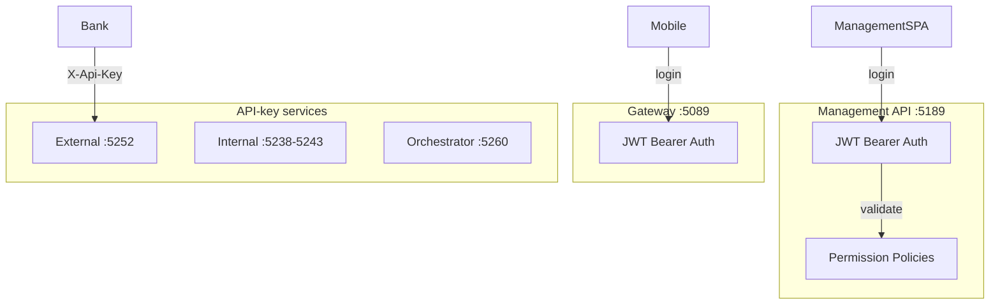

# KYC flow, validation & portal approval

## Authentication flows

---

## Permission model (Management API)

| Permission | Scope |
|------------|-------|
| `Permissions.Users.Read` | View user list |
| `Permissions.Users.Write` | Create / edit users |
| `Permissions.Stock.Read` | View stock inventory |
| `Permissions.Stock.Write` | Import / export / transfer |
| `Permissions.Reports.Read` | View reports |
| `Permissions.Reports.Export` | Export report CSV |
| `Permissions.Configuration.Read` | View configuration |
| `Permissions.Configuration.Write` | Edit configuration |

---

## Related pages

- [System hardening](../security/README.md)
- [Staff credential lifecycle](../security/staff-credential-lifecycle.md)
- [API conventions](../reference/api-conventions.md)
