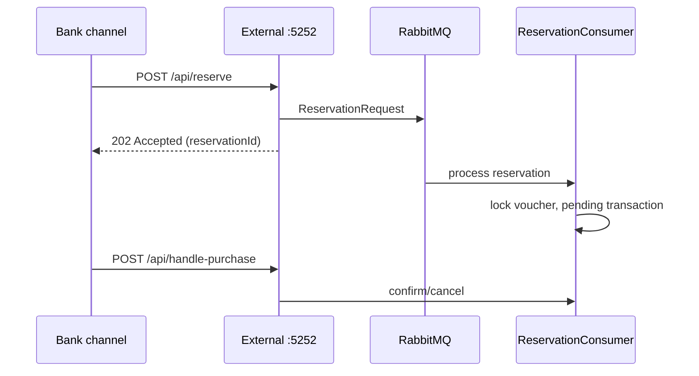
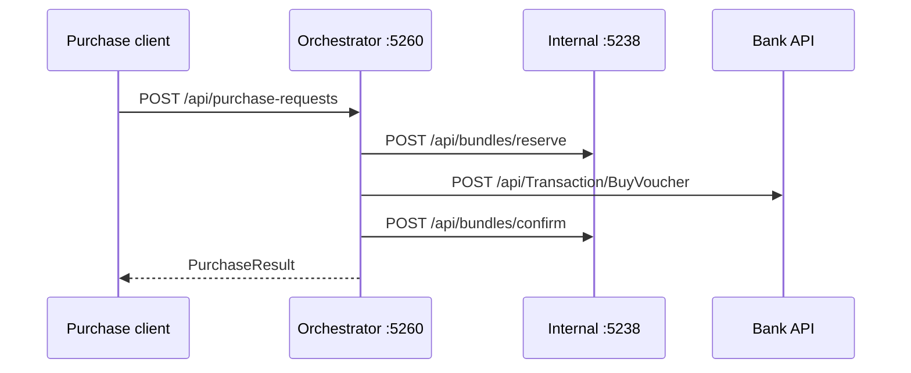

# Money movement (sequence diagrams)

## Reservation flow

```mermaid
sequenceDiagram
    participant Client as Bank channel
    participant Ext as External :5252
    participant RMQ as RabbitMQ
    participant RC as ReservationConsumer

    Client->>Ext: POST /api/reserve
    Ext->>RMQ: ReservationRequest
    Ext-->>Client: 202 Accepted (reservationId)
    RMQ->>RC: process reservation
    RC->>RC: lock voucher, pending transaction
    Client->>Ext: POST /api/handle-purchase
    Ext->>RC: confirm/cancel
```

## Bundle purchase flow

```mermaid
sequenceDiagram
    participant Client as Purchase client
    participant Orch as Orchestrator :5260
    participant Int as Internal :5238
    participant Bank as Bank API

    Client->>Orch: POST /api/purchase-requests
    Orch->>Int: POST /api/bundles/reserve
    Orch->>Bank: POST /api/Transaction/BuyVoucher
    Orch->>Int: POST /api/bundles/confirm
    Orch-->>Client: PurchaseResult
```

---

## Related pages

- [Flow diagrams](flow-diagrams.md)
- [Platform capabilities](README.md)
