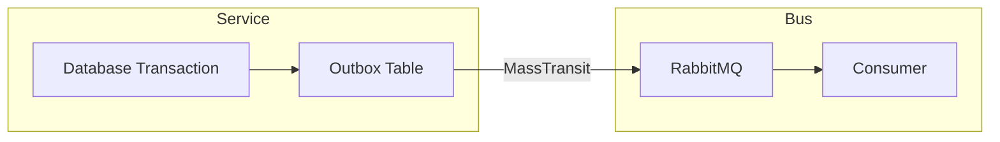

# Outbox & ledger consistency

## Transactional outbox

The Voucher Provider uses **MassTransit EF Core outbox** with PostgreSQL to ensure at-least-once message delivery:

**Consistency guarantee:** Messages are only published if the database transaction commits.

---

## Idempotency

| Component | Mechanism |
|-----------|-----------|
| Reservation | `ReservationIdempotencyRecords` table |
| Purchase | `PurchaseIdempotencyRecords` table |
| Saga | MassTransit saga state machine (automatic) |

---

## Consistency boundaries

- **No distributed transactions** — each service manages its own database
- **Saga-based coordination** for multi-step purchases
- **gRPC remote calls** are idempotent with deadline/retry

---

## Related pages

- [Platform capabilities](README.md)
- [Domain events](events.md)
