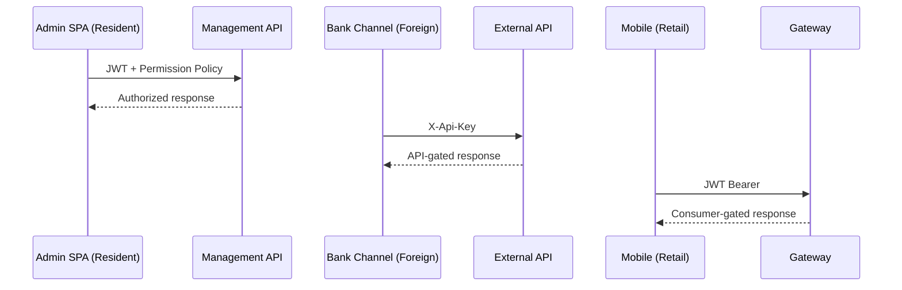

# Resident & foreign gateway personas

## API persona mapping

| Persona | API Surface | Auth | Purpose |
|---------|-------------|------|---------|
| **Admin (resident)** | Management API :5189 | JWT + permissions | Central stock, users, reports |
| **Bank channel (foreign)** | External API :5252 | API key | Async reservations, purchase |
| **Mobile user (retail)** | Gateway :5089 | JWT | Sync reserve/purchase |
| **Internal bank stock** | Internal APIs :5238–5243 | API key | Per-bank inventory |

---

## Request flow by persona

---

## Related pages

- [Platform capabilities](README.md)
- [Service reference index](../reference/)
