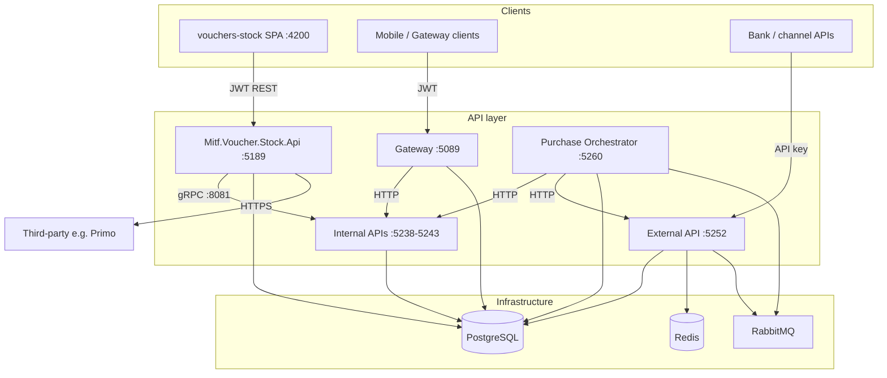

# Workspace overview

High-level map of services, data stores, and interaction paths in the Voucher Provider monorepo.

---

## Service diagram

---

## Service responsibilities

| Service | Owns | Does not own |
|---------|------|--------------|
| **Management** | Main stock, users, reports, third-party config, export orchestration | Bank channel transactions |
| **Internal** | Bank-local voucher stock, bundle reserve/confirm, gRPC bridge | Central import UI |
| **External** | Bank-facing catalog, async reservations, purchase confirm | Admin users |
| **Gateway** | Mobile auth, catalog proxy, sync reserve/purchase | Stock inventory source of truth |
| **Orchestrator** | Multi-step bundle/international purchase sagas | Long-term stock storage |
| **SPA** | Admin UX | Any persistent data |

---

## gRPC remote stock

**Contract:** `grpc/stock_remote_v1.proto` — service `StockRemoteBridge`

Management calls internal bank APIs for:

- Export: `BulkInsertVouchers`, bundle equivalents
- Reads: counts, summaries, transaction reports
- Config: `ReplaceEnabledEntities`, rules sync
- Transfers: `AcquireTransferVouchers`, `ReleaseTransferVouchers`

**Rule:** No direct remote SQL from Management — all via `IRemoteStockGrpcGateway`.

---

## Messaging (MassTransit / RabbitMQ)

| Service | Role |
|---------|------|
| External | Publishes/consumes reservation messages |
| Orchestrator | Runs bundle/international sagas |
| Management, Internal, Gateway | No MassTransit (sync HTTP/gRPC) |

Virtual host: `voucher`

---

## Per-service reference

| Service | Reference |
|---------|-----------|
| Management | [Management API](../reference/management-api.md) |
| External | [External API](../reference/external-api.md) |
| Internal | [Internal API](../reference/internal-api.md) |
| Gateway | [Gateway](../reference/gateway.md) |
| Orchestrator | [Purchase orchestrator](../reference/purchase-orchestrator.md) |
| SPA | [vouchers-stock SPA](../reference/vouchers-stock-spa.md) |

---

## Flow documentation

| Flow | Document |
|------|----------|
| Purchase / reservation | [Flow diagrams](flow-diagrams.md#1-purchase--reservation-flow) |
| Stock management | [Flow diagrams](flow-diagrams.md#2-stock-management-flow) |
| Third-party stock | [Flow diagrams](flow-diagrams.md#3-third-party-stock-integration-flow) |
| Remote gRPC | [Flow diagrams](flow-diagrams.md#4-remote-foreign-stock-grpc-flow) |
| RabbitMQ | [Flow diagrams](flow-diagrams.md#5-rabbitmq--masstransit-message-flows) |
