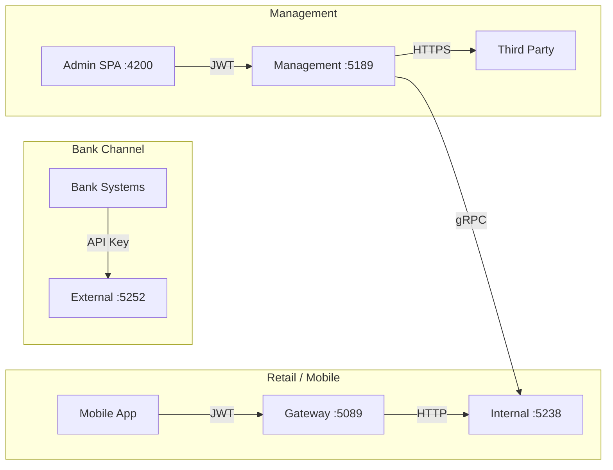

# Masarat segments — service personas

The Voucher Provider platform serves three primary consumer segments, each with distinct API surfaces and integration patterns.

---

## Segment mapping

| Segment | API surface | Auth | Typical client |
|---------|-------------|------|----------------|
| **Management (admin)** | Management API :5189 | JWT + permission policies | Admin SPA (:4200) |
| **Bank channel** | External API :5252 | API key | Bank backend systems |
| **Mobile / retail** | Gateway :5089 | JWT (mobile user) | Mobile apps |
| **Internal bank stock** | Internal APIs :5238–5243 | API key | Per-bank services |
| **Purchase orchestration** | Orchestrator :5260 | API key | Saga coordination |

---

## Interaction patterns

---

## Related pages

- [Platform capabilities](../architecture/README.md)
- [Service reference index](../reference/)
