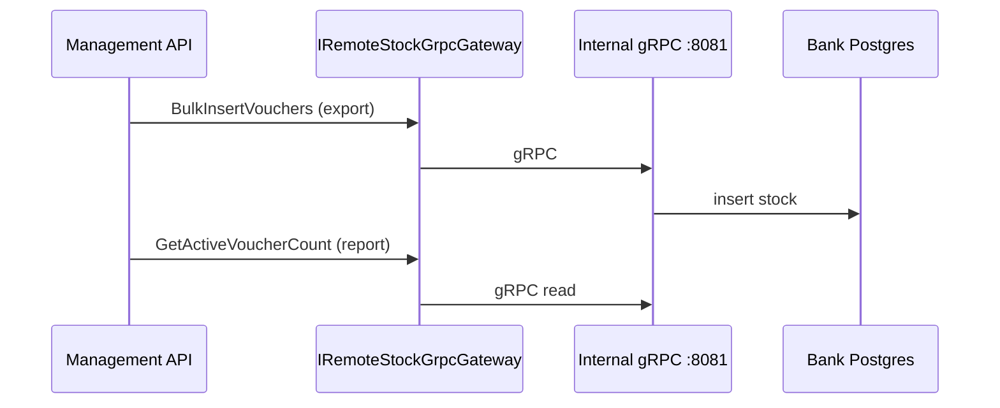

# gRPC remote stock bridge

## Overview

Management API communicates with per-bank Internal APIs via gRPC for remote stock operations. This replaces direct database access.

**Contract:** `grpc/stock_remote_v1.proto` — service `StockRemoteBridge`

---

## gRPC operations

| RPC | Direction | Purpose |
|-----|-----------|---------|
| `BulkInsertVouchers` | Management → Internal | Export vouchers to bank |
| `GetActiveVoucherCount` | Management → Internal | Stock count report |
| `GetTransactions` | Management → Internal | Transaction report |
| `AcquireTransferVouchers` | Management → Internal | Branch transfer in |
| `ReleaseTransferVouchers` | Management → Internal | Branch transfer out |
| `ReplaceEnabledEntities` | Management → Internal | Sync feature flags |

---

## gRPC configuration

| Setting | Default | Description |
|---------|---------|-------------|
| `RemoteStockGrpc.Enabled` | `true` | Enable gRPC gateway |
| `RemoteStockGrpc.DeadlineSeconds` | `30` | gRPC call timeout |
| `RemoteStockGrpc.SkipServerCertificateValidation` | `false` | Dev only |

---

## Flow

---

## Related pages

- [Workspace overview](../architecture/workspace-overview.md)
- [Flow diagrams](../architecture/flow-diagrams.md)
- [Internal API reference](../reference/internal-api.md)
