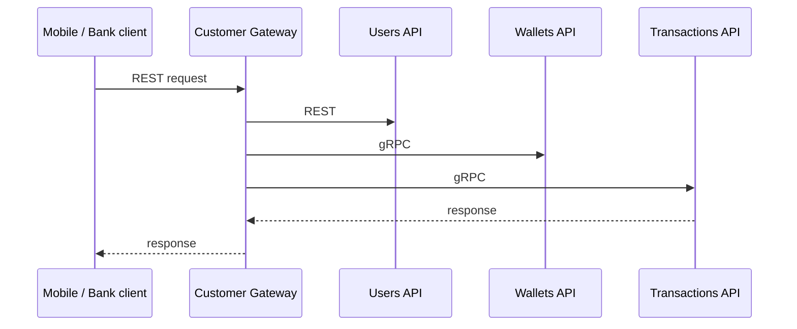

# API reference

## API versioning

REST versioning policy:

- No `/v1` in paths unless introduced
- Additive changes are non-breaking
- Breaking changes are documented in [changelog](../changelog/)

| Change type | Example | Breaking? |
|-------------|---------|-----------|
| Add new endpoint | `POST /api/new-resource` | No |
| Add optional field | New query param | No |
| Remove endpoint | `DELETE /api/old` | Yes |
| Rename field | `name` → `fullName` in response | Yes |
| Change auth | API key → JWT | Yes |

gRPC follows protobuf wire compatibility.

---

## Typical call sequence

---

## Base URLs

| Service | Local URL |
|---------|-----------|
| Management API | http://localhost:5189 |
| External API | http://localhost:5252 |
| Gateway | http://localhost:5089 |
| Internal | http://localhost:5238–5243 |
| Orchestrator | http://localhost:5260 |

---

## Health endpoints

| Endpoint | Behavior |
|----------|----------|
| `GET /health` | Liveness check |
| `GET /health/ready` | Readiness check (503 while seeding) |

---

## Related pages

- [gRPC services](grpc-services.md)
- [Configuration reference](configuration-reference.md)
- [API conventions](api-conventions.md)
