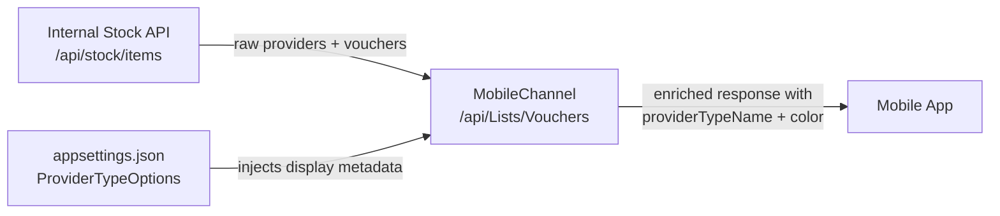

# MobileChannel — Provider Display Mapping Configuration

## Overview

The `ProviderTypeOptions` section in `appsettings.json` controls how voucher providers are **grouped, labeled, and colored** in the mobile app UI. It is a **static UI metadata layer** that lives in the MobileChannel config — it is not stored in any database and has no effect on the stock or voucher APIs.

Without this configuration, the mobile app receives raw stock data from the Internal API but has no way to:
- Group providers under a category (e.g. "اتصالات", "صحة", "Vouchers")
- Assign a display color to each provider's card
- Map a `providerId` to a human-readable type name

---

## How It Works



The MobileChannel merges the two sources at runtime:
- **Stock data** → from the Internal API (provider IDs and voucher values)
- **Display metadata** → from `ProviderTypeOptions` in config (type name and color per provider)

If a `providerId` from the stock API is **not listed** in `ProviderTypeOptions`, it will be silently excluded from the mobile app response.

---

## Configuration Structure

```json
"ProviderTypeOptions": {
  "ProviderTypes": [
    {
      "ProviderTypeId": <int>,
      "ProviderTypeName": "<display name shown in app>",
      "RelatedProviders": [
        {
          "ProviderId": "<string — must match providerId from Internal API>",
          "Color": "<hex color code for the card in the mobile UI>"
        }
      ]
    }
  ]
}
```

### Field Reference

| Field | Type | Required | Description |
|---|---|---|---|
| `ProviderTypeId` | integer | ✅ | Unique ID for the provider category |
| `ProviderTypeName` | string | ✅ | Category label displayed in the mobile app |
| `RelatedProviders` | array | ✅ | List of providers that belong to this category |
| `ProviderId` | string | ✅ | Must exactly match the `providerId` returned by the Internal Stock API |
| `Color` | string | ✅ | Hex color code (with or without `#`) for the provider card UI |

---

## Example Entry

```json
{
  "ProviderTypeId": 3,
  "ProviderTypeName": "Vouchers",
  "RelatedProviders": [
    { "ProviderId": "1", "Color": "#34EB4F" },
    { "ProviderId": "2", "Color": "#800f63" },
    { "ProviderId": "3", "Color": "#FFA500" }
  ]
}
```

This entry tells MobileChannel:
- Providers `1`, `2`, and `3` belong to the **"Vouchers"** category
- Each provider gets a distinct card color in the mobile UI
- Any provider ID from the Internal API that is **not** in this list will not appear in the app

---

## Important Notes for DevOps

> ⚠️ **This list must be kept in sync with the Internal Stock API.**
> If a new provider is added to the bank's Internal API, it **must also be added here** with a `ProviderTypeId`, `ProviderTypeName`, and `Color` — otherwise it will be invisible to mobile users.

> ⚠️ **ProviderId is a string and must match exactly.**
> The Internal API returns provider IDs as strings. A mismatch (e.g. `1` vs `"01"`) will cause the provider to be silently dropped from the mobile response.

> ℹ️ **This is UI metadata only.**
> Changing `ProviderTypeName` or `Color` has no effect on stock levels, voucher state, or any database. It only affects what the mobile user sees.

> ℹ️ **Multiple banks — multiple configs.**
> Each bank deployment has its own `appsettings.json`. Provider IDs are scoped per bank. The same `ProviderId` value may refer to a different provider in a different bank's Internal API.

---

## How to Add a New Provider

1. Confirm the new provider's ID from the Internal Stock API:
   ```
   GET /api/stock/items?includeDisabledProviders=true
   ```
2. Decide which `ProviderTypeId` category it belongs to (or create a new one)
3. Add it under `RelatedProviders` in the correct `ProviderTypes` entry:
   ```json
   { "ProviderId": "<new id>", "Color": "<hex color>" }
   ```
4. Restart the MobileChannel service to apply the change
5. Verify the provider appears in the mobile app's voucher list

---

## How to Add a New Provider Category

1. Add a new object to the `ProviderTypes` array
2. Assign a unique `ProviderTypeId` (do not reuse existing IDs)
3. Set a `ProviderTypeName` (this is the label shown in the app)
4. List all `RelatedProviders` that belong to this category
5. Restart MobileChannel

---

