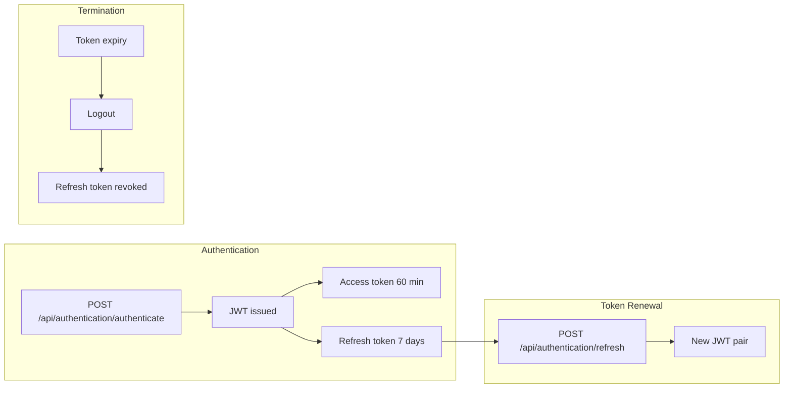

# Staff credential lifecycle

## JWT token lifecycle

---

## Password policy

| Setting | Value |
|---------|-------|
| Min length | 8 characters |
| EasyPass bypass | Dev only (`Auth:AllowEasyPass`) |
| Password reset | Admin-initiated via Management API |

---

## Permission management

Admin users manage permissions via the SPA (`/api/users/*` + `/api/permissions/*`). Changes take effect on next request (JWT must be re-issued).

---

## Related pages

- [System hardening](README.md)
- [KYC flow, validation & portal approval](../architecture/kyc-flow-validation-and-portal-approval.md)
