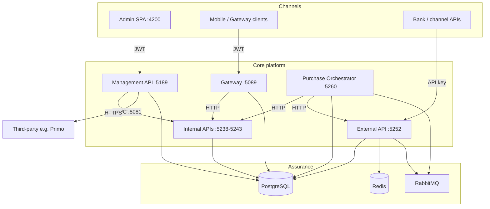

# MITF Voucher Provider — platform at a glance

## What leadership should know

- **Single source of truth** — All voucher stock, from central custody through bank inventories and third-party providers, is tracked in purpose-built databases with an immutable audit trail.
- **Ready for bank integration** — Per-bank internal APIs with gRPC remote stock bridge for export, transfer, and reporting — no direct database sharing.
- **Reliable messaging** — Async reservation processing via MassTransit / RabbitMQ with idempotency guards and saga orchestration for bundle and international purchases.
- **Capacity** — Internal lab tests demonstrate tens to low hundreds of voucher transactions per second across the core stack.
- **Compliance monitoring** — Structured logging, API-level authentication (JWT, API keys), activity audit trails, and reconciliation-ready export operations.
- **QA pyramid** — Newman (API contracts), Playwright (UI CRUD), Maestro (UI smoke) — run locally or in CI for every push.

---

## How the pieces fit

---

## Who should read which page

| Role | Start here | Then |
|---|---|---|
| Product / business owner | This page | [Executive overview](executive-overview.md) |
| Platform engineer | [Platform capabilities](../architecture/README.md) | [Operations & technology](operations-and-technology.md) |
| QA lead | [UI testing overview](../flows/ui-testing-overview.md) | [Playwright UI testing](../flows/playwright-ui-testing.md) |
| Security reviewer | [System hardening](../security/README.md) | [Risk, compliance & finance](risk-compliance-and-finance.md) |
| Integrator | [Service reference index](../reference/) | [API conventions](../reference/api-conventions.md) |

---

## Proof points (internal lab — not an SLA)

Large-scale internal tests with deliberate failure injection and duplicate replay verify:

- Reservation idempotency (duplicate `Idempotency-Key` rejected)
- gRPC remote bridge resilience (deadline / retry)
- Saga state-machine durability across process restarts
- Concurrent transfer backpressure with `MaxInFlightTransfers`
