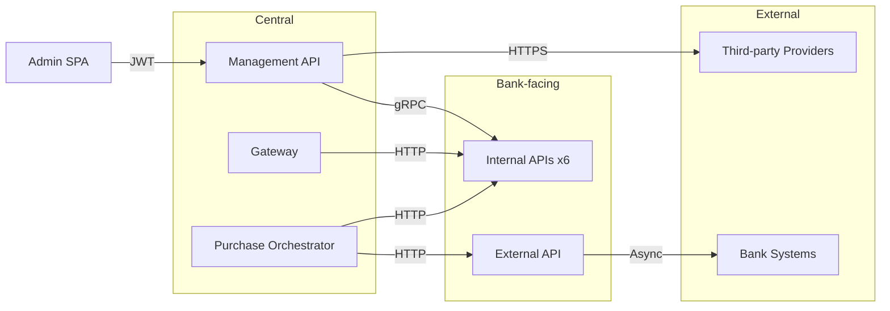

# Executive & business overview

## Business context

MITF Voucher Provider enables banks and telecom partners to manage digital voucher stock across the full lifecycle:

1. **Central stock custody** — Import voucher secrets from telecom providers, encrypt at rest, maintain inventory.
2. **Bank distribution** — Export stock to per-bank internal APIs via gRPC with custody transfer tracking.
3. **Channel purchase** — Mobile and bank channel clients browse, reserve, and purchase vouchers through Gateway and External APIs.
4. **Bundle and international purchases** — Orchestrated sagas reserve stock internally, execute financial transactions externally, and confirm delivery.
5. **Third-party integration** — Refill stock from upstream providers (e.g. Primo Wallet) via HTTPS with configurable resilience policies.

---

## Key metrics

| Metric | Detail |
|--------|--------|
| Services | 5 API services + 1 SPA + 6 internal bank instances |
| Infrastructure | PostgreSQL 16, Redis 7, RabbitMQ 3.13 |
| Framework | .NET 10.0 (ASP.NET Core) |
| Banks (compose) | Jumhoria, Tejari, Sahara, Daman, Alsiraj, Alwaha |
| QA tools | Newman, Playwright, Maestro |
| CI | GitHub Actions — Docker Hub push + QA regression |

---

## Integration landscape

---

## Related pages

- [Platform capabilities](../architecture/README.md)
- [Risk, compliance & finance](risk-compliance-and-finance.md)
- [Production deployment](../operations/production-deployment.md)
