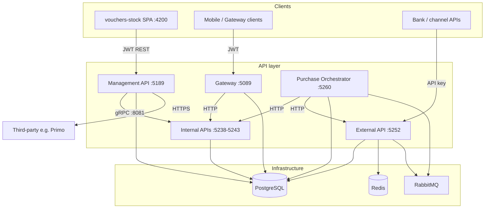

# Operations & technology

## Technology stack

| Component | Technology |
|-----------|------------|
| Runtime | .NET 10.0 (ASP.NET Core) |
| APIs | REST (Swashbuckle) + gRPC |
| Databases | PostgreSQL 16 per service |
| Cache | Redis 7 |
| Messaging | RabbitMQ 3.13 / MassTransit |
| UI | Angular 18+ |
| Containerization | Docker Compose |
| CI / CD | GitHub Actions |
| Observability | OpenTelemetry → Prometheus / Loki / Tempo → Grafana |

---

## Service summary

| Service | Role | Database | Auth |
|---------|------|----------|------|
| Management API | Admin stock, users, reports, third-party | `Voucher.Management.Db.Reclaim` | JWT + permissions |
| External API | Bank-facing stock, async reservations | `Voucher.External.Db` | API key |
| Internal APIs (x6) | Per-bank stock with gRPC bridge | `Voucher.Internal.*.Db.Reclaim` | API key |
| Gateway | Mobile BFF, catalog proxy | `Voucher.Gateway` | JWT |
| Purchase Orchestrator | Saga-based bundle/international purchases | `Voucher.PurchaseOrchestrator` | API key |
| Stock SPA | Angular admin UI | None (HTTP client) | JWT via Management |

---

## Infrastructure architecture

---

## Related pages

- [Production deployment](../operations/production-deployment.md)
- [Logging & observability](../operations/logging.md)
- [Load testing operations](../load-testing/README.md)
